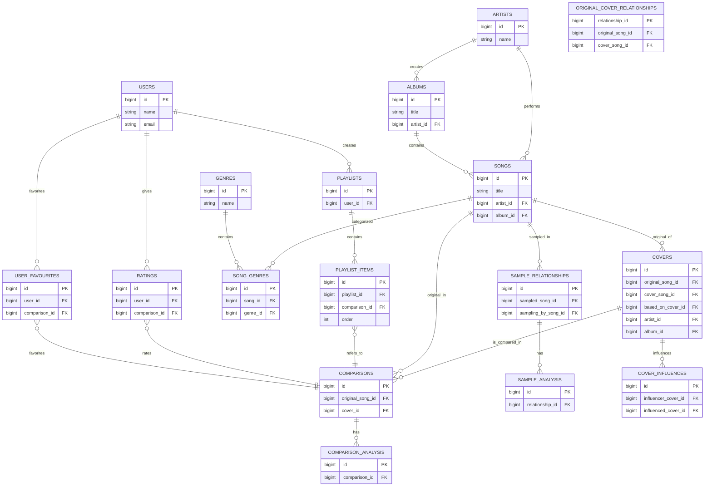

Project: MusicEvolution (Song App)
=================================

What I'm going to add
- A concise README describing the app, tools & tech used
- Mermaid ER diagrams of the database (derived from migrations)
- Step-by-step instructions to start the app with Docker (using the existing `docker-compose.yml`)

Overview
--------
MusicEvolution ("song-app") is a Laravel application that models song relationships such as covers, samples, comparisons and analyses. It provides browsing by genre, playlists, and tools for exploring how music evolves.

Key features
- Browse songs, covers and samples
- Track relationships between original songs and covers
- Compare originals vs covers and compute audio analysis
- Playlists, ratings, and user favourites

Tech & Tools
------------
- Backend: PHP 8.x (Laravel)
- Frontend: React + Inertia + Vite + TypeScript
- Styling: Tailwind CSS
- Icons: lucide-react
- DB: SQLite (default in repo) / MySQL/Postgres supported via configuration
- Docker: docker-compose for local containers

Project structure (high level)
- app/ - Laravel app
- resources/js - React + Inertia frontend
- database/migrations - DB schema (used to build diagrams below)
- docker/ + docker-compose.yml - Docker configuration for PHP, Nginx and Vite

Database ER diagrams (Mermaid)
--------------------------------
Note: diagrams are derived from the migrations in `database/migrations/` (as of this README).

Entity-Relationship (high-level)



Notes on the diagram
- `songs` is a central entity and links to `artists`, `albums`, `covers`, `comparisons`, `sample_relationships`, and `genres`.
- `covers` reference both `original_song_id` and `cover_song_id` allowing representation of cover-song as a first-class object.
- `comparisons` join `original_song` and `cover` entities and have a `comparison_analysis` table for audio/metadata metrics.

Detailed Mermaid ER diagram (columns & types)
--------------------------------------------
The diagram below lists the most important tables with their columns and basic types as declared in the migrations.

```mermaid
erDiagram
    USERS {
        bigint id PK
        varchar username UNIQUE
        varchar first_name
        varchar last_name
        varchar password_hash
        varchar display_name
        text bio
        varchar profile_image_url
        varchar email UNIQUE
        timestamp email_verified_at NULL
        varchar password
        timestamp last_login_at NULL
        varchar remember_token NULL
        timestamp created_at
        timestamp updated_at
        timestamp deleted_at NULL
    }

    ARTISTS {
        bigint id PK
        varchar name
        text bio
        int formed_year
        varchar image_url
        varchar external_url
        timestamp created_at
        timestamp updated_at
        timestamp deleted_at NULL
    }

    ALBUMS {
        bigint id PK
        varchar title
        bigint artist_id FK
        date release_date
        varchar cover_image_url
        int view_count
        boolean is_featured
        varchar external_url
        timestamp created_at
        timestamp updated_at
        timestamp deleted_at NULL
    }

    SONGS {
        bigint id PK
        varchar title
        bigint artist_id FK
        bigint album_id FK
        int view_count
        boolean is_featured
        date release_date
        int duration
        varchar audio_url
        varchar video_url
        varchar waveform_url
        boolean is_original
        text lyrics
        timestamp created_at
        timestamp updated_at
        timestamp deleted_at NULL
    }

    COVERS {
        bigint id PK
        bigint original_song_id FK
        bigint cover_song_id FK
        bigint based_on_cover_id FK NULL
        varchar title
        bigint artist_id FK
        int view_count
        boolean is_featured
        bigint album_id FK
        date release_date
        int duration
        varchar audio_url
        varchar video_url
        varchar waveform_url
        text lyrics
        timestamp created_at
        timestamp updated_at
        timestamp deleted_at NULL
    }

    COMPARISONS {
        bigint id PK
        bigint original_song_id FK
        bigint cover_id FK
        varchar title
        varchar description
        boolean featured
        int view_count
        timestamp created_at
        timestamp updated_at
        timestamp deleted_at NULL
    }

    COMPARISON_ANALYSIS {
        bigint id PK
        bigint comparison_id FK
        float tempo_original
        float tempo_cover
        varchar key_original
        varchar key_cover
        float instrumentation_difference
        float vocal_style_difference
        float transformation_level
        json additional_data
        timestamp created_at
        timestamp updated_at
        timestamp deleted_at NULL
    }

    SAMPLE_RELATIONSHIPS {
        bigint id PK
        bigint sampled_song_id FK
        bigint sampling_by_song_id FK
        int sample_start_time
        int sample_end_time
        int placement_time
        text sample_description
        boolean is_confirmed
        timestamp created_at
        timestamp updated_at
        timestamp deleted_at NULL
    }

    SAMPLE_ANALYSIS {
        bigint id PK
        bigint relationship_id FK
        float tempo_change
        int pitch_shift
        float transformation_level
        int chop_complexity
        text additional_effects
        json additional_data
        timestamp created_at
        timestamp updated_at
        timestamp deleted_at NULL
    }

    COVER_INFLUENCES {
        bigint id PK
        bigint influencer_cover_id FK
        bigint influenced_cover_id FK
        text influence_description
        timestamp created_at
        timestamp updated_at
        timestamp deleted_at NULL
    }

    ORIGINAL_COVER_RELATIONSHIPS {
        bigint relationship_id PK
        bigint original_song_id FK
        bigint cover_song_id FK
        bigint relationship_type_id NULL
    }

    GENRES {
        bigint id PK
        varchar name
        varchar description
        timestamp created_at
        timestamp updated_at
        timestamp deleted_at NULL
    }

    SONG_GENRES {
        bigint id PK
        bigint song_id FK
        bigint genre_id FK
        timestamp created_at
        timestamp updated_at
        timestamp deleted_at NULL
    }

    PLAYLISTS {
        bigint id PK
        bigint user_id FK
        varchar name
        text description
        boolean is_public
        varchar cover_image_url
        timestamp created_at
        timestamp updated_at
        timestamp deleted_at NULL
    }

    PLAYLIST_ITEMS {
        bigint id PK
        bigint playlist_id FK
        bigint comparison_id FK
        int order
        timestamp added_at
        timestamp created_at
        timestamp updated_at
        timestamp deleted_at NULL
    }

    RATINGS {
        bigint id PK
        bigint user_id FK
        bigint comparison_id FK
        int score
        timestamp created_at
        timestamp updated_at
    }

    USER_FAVOURITES {
        bigint id PK
        bigint user_id FK
        bigint comparison_id FK
        timestamp created_at
        timestamp updated_at
        timestamp deleted_at NULL
    }

    USER_HISTORY {
        bigint id PK
        bigint user_id FK
        bigint comparison_id FK
        timestamp viewed_at
        timestamp created_at
        timestamp updated_at
    }

    %% Relationships (detailed)
    USERS ||--o{ PLAYLISTS : "creates"
    USERS ||--o{ RATINGS : "gives"
    USERS ||--o{ USER_FAVOURITES : "favorites"
    USERS ||--o{ USER_HISTORY : "views"

    ARTISTS ||--o{ ALBUMS : "creates"
    ARTISTS ||--o{ SONGS : "performs"
    ALBUMS ||--o{ SONGS : "contains"

    SONGS ||--o{ COVERS : "original_of"
    COVERS ||--o{ COMPARISONS : "is_compared_in"
    SONGS ||--o{ COMPARISONS : "original_in"

    COMPARISONS ||--o{ COMPARISON_ANALYSIS : "has"

    SONGS ||--o{ SAMPLE_RELATIONSHIPS : "sampled_in"
    SAMPLE_RELATIONSHIPS ||--o{ SAMPLE_ANALYSIS : "has"

    COVERS ||--o{ COVER_INFLUENCES : "influences"

    SONGS ||--o{ SONG_GENRES : "categorized"
    GENRES ||--o{ SONG_GENRES : "contains"

    PLAYLISTS ||--o{ PLAYLIST_ITEMS : "contains"
    PLAYLIST_ITEMS }o--|| COMPARISONS : "refers_to"

    RATINGS }o--|| COMPARISONS : "rates"
    USER_FAVOURITES }o--|| COMPARISONS : "favorites"

```

Running the app with Docker
---------------------------
Prerequisites
- Docker and docker-compose installed on your machine
- Copy or create a `.env` file in the project root with the required values (see below)

Recommended `.env` variables (at minimum)
```
APP_NAME=songapp
APP_PORT=8443
VOLUME_LOCAL_MACHINE=/absolute/path/to/your/song-app # used by docker-compose to bind mount the project
APP_ENV=local
APP_DEBUG=true
DB_CONNECTION=sqlite
```

Start the whole stack (PHP + Nginx + Vite)

```bash
# Build images and start in detached mode
docker-compose up --build -d

# Wait a few seconds for containers to be ready, then run migrations
docker-compose exec php php artisan migrate --force

# (Optional) Seed demo data
docker-compose exec php php artisan db:seed

# View logs (web container)
docker-compose logs -f web
```

Notes about the `vite` service
- The `vite` service in `docker-compose.yml` will build frontend assets and run watch mode. It mounts your host project directory into the container, installs node modules when needed, builds assets and runs `npm run watch`.

If you prefer a one-off build locally (host machine)
```bash
npm install
npm run build
```

Accessing the app
- Open your browser at https://localhost:${APP_PORT} (the `web` service maps container port 443 to `APP_PORT`). If you used `APP_PORT=8443` the URL is https://localhost:8443

Troubleshooting
- If Docker fails to mount the project, ensure `VOLUME_LOCAL_MACHINE` is an absolute path and accessible to Docker.
- If `npm`/`vite` fails inside the container, run the build locally and copy assets into `public/build`.

Developer tips
- Use `docker-compose exec php bash` to open a shell in the PHP container for artisan commands
- Tail all logs: `docker-compose logs -f`
- Rebuild assets if you change frontend code: `docker-compose exec vite npm run build`

Acknowledgements & license
- Icons: lucide-react
- Built with Laravel, Inertia, React, Tailwind and Vite

Contact / Further documentation
- See the `database/migrations/` files for the full schema details and constraints.

---
Generated: 2026-03-30


